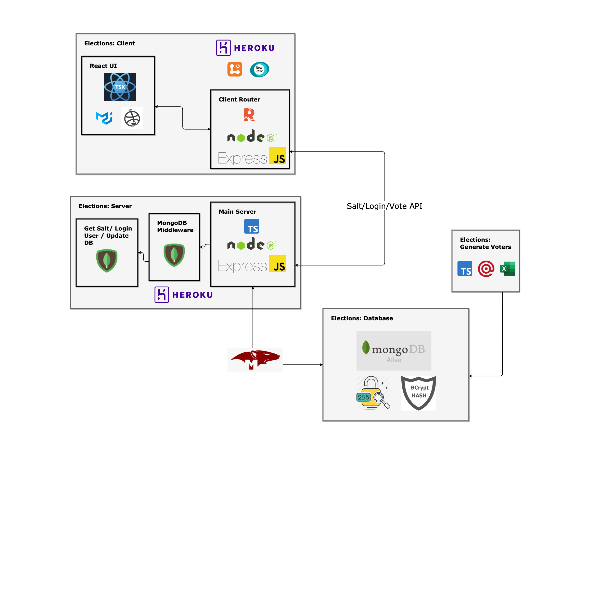

# Elections Backend

Server layer built with `Typescript`, `Node JS`, `Express` and `Mongoose`.

## Quick Setup

- Set up `.env`, as per the `.env.example` file (contact it@cssa-aei.ca for assistance)
- Run `yarn install`
- Run `yarn dev`

## Routes

### User Routes

- POST `/api/salt` with body: `sha` --> Fetches the 1st level salt of the voter for client-side hashing.

- POST `/api/login` with body: `sha` & `hash` --> (_withAuth_) --> Authenticates the voter through middleware.

### Vote Routes

- POST `/api/vote` with body: `sha` & `hash` & `poll` --> (_withAuth_) --> Inserts the voter's `poll` data in DB.

## Scripts

- `yarn dev` - Compiles TS with watch tag & starts the server on port 5000 with nodemon
- `yarn clean` - Removes the `/dist` directory
- `yarn build` - Compiles TS
- `yarn start` - Starts the server on port 5000 with node (Mostly used by Heroku)
- `yarn populate` - Populates DB with voter data & fires emails through MailGun
- `yarn lint` - Scans the repo for any eslint violations
- `yarn lint:fix` - Fixes eslint violations
- `yarn prettier` - Reformats code to Prettier standards & fixes eslint violations

## Architecture

